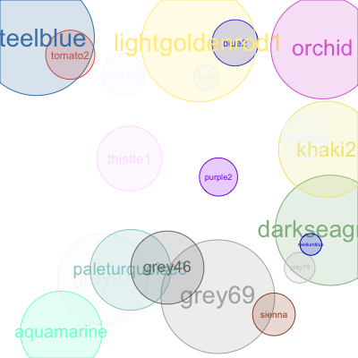

# README

`transparent` is a simple little R library that allows us to conveniently set the alpha level of any of the standard R colours. It also has a few little functions that wrap the `graphics::polygon` function and allow us to add circles and rectangles to plots.

## Install

Install the library directly from github using the [`devtools`](https://github.com/hadley/devtools) library:

```r
devtools::install_github("ram6ler/transparent")
```


## Example

Here is a little script that adds 20 randomly coloured circles to a plot.


```r
library(transparent)

# create an empty plot
par(mar = c(0, 0, 0, 0))
plot.new()
plot.window(xlim = c(0, 1), ylim = c(0, 1))

# start adding circles...
n <- 20
for (j in 1:n) {

  # circle centre
  x <- runif(1)
  y <- runif(1)
  
  # circle radius
  r <- runif(1) * 0.15 + 0.025
  
  # a random standard colour
  rand_col <- sample(colors(), 1)
  
  # the colour, with alpha level lowered
  fill_col <- setAlpha(rand_col, 0.2)
  
  # draw a circle using the colours
  circle(x, y, r, border = rand_col, col = fill_col)
  
  # insert the name of the colour as a label
  text(x, y, labels = rand_col, col = rand_col, cex = r * 10)
}
```

